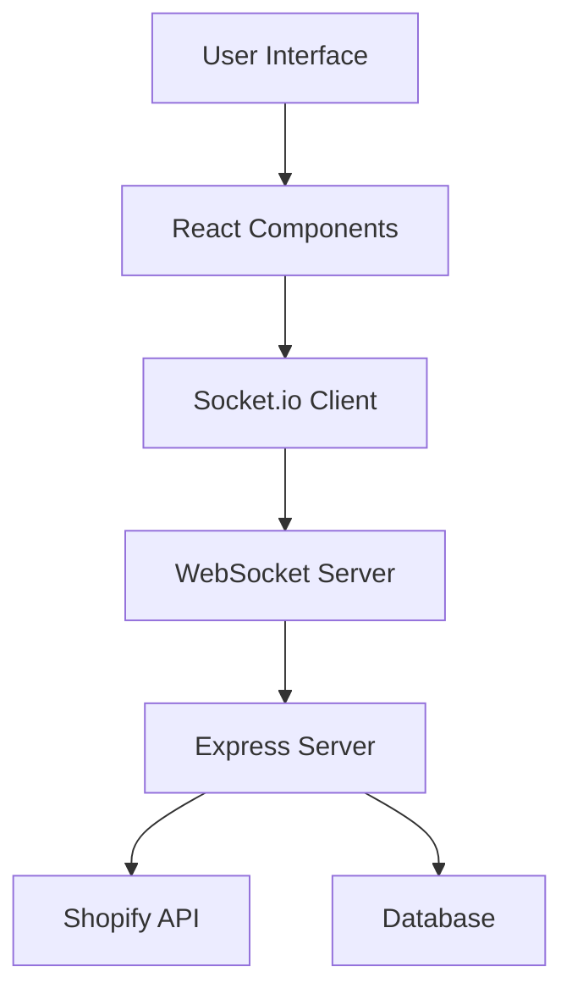

# HeyBud Architecture

## Overview
HeyBud is a real-time shared shopping experience platform built on Shopify. It enables multiple users to shop together through screen sharing, voice chat, and synchronized product viewing.

## Core Components

### Frontend
- React components for UI
- Shopify Polaris for design system
- Socket.io client for real-time communication
- WebRTC for voice/video sharing

### Backend
- Express.js server
- Socket.io for WebSocket handling
- Shopify API integration
- Analytics tracking system

## Data Flow

## State Management
- Local component state for UI
- Socket.io for real-time state sync
- Session state for user tracking
- Product sync state

## Security
- Shopify authentication
- WebSocket connection validation
- Rate limiting
- Input sanitization

## Scalability
- Horizontal scaling capabilities
- Redis for session management
- Load balancing support
- CDN integration

## Testing Strategy
- Unit tests for components
- Integration tests for API
- E2E tests for critical flows
- Performance testing